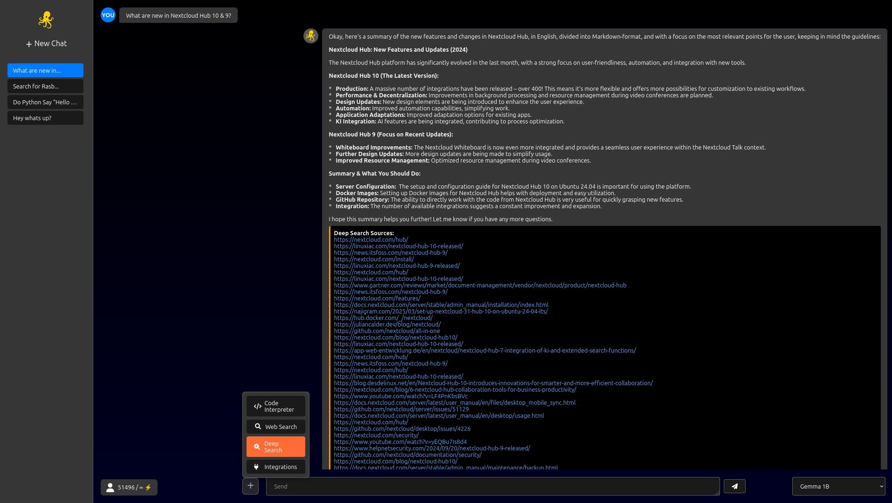
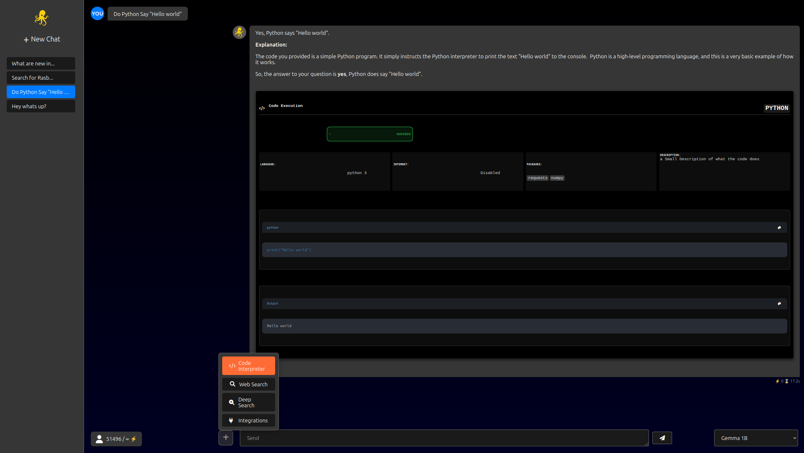

# TontooAI 🌐

A **Ollama** Web UI build in NodeJS, easy to Setup

---

## Features

- 🖥️ **Web UI** for Ollama AI models
- 🌙 **Dark Mode** with responsive design (Only Dark Mode!)
- 💬 **Chat history** saving and loading
- 🔀 **Multi-model support**
- 📸 **Easy Config**
- 🖥️ **Admin Panel with Status and more**

---

## Demo

### Chat


### Settings
![Settings]pre/2.png)

### Adminpanel Dashboard


### Adminpanel Users


---

## Installation

### Requirements

- Node.js >= 18
- npm
- Ollama installed ([Installation guide](https://ollama.com/docs/install))

### Clone the Repository

```bash
git clone https://github.com/arlomu/TontooAI.git
````

## Usage

### Development

```bash
sudo bash setup.sh
```

Open your browser at [http://localhost](http://localhost)
Or at Port 8080 As Seccond Server

---

## Feature Request

[1. Creating a Request](https://ziel-url.com)


---

## License

MIT License © 2025

---

## Contact

* GitHub Issues: [https://github.com/your-username/ollama-web-ui/issues](https://github.com/your-username/ollama-web-ui/issues)
* Email: [your@email.com](mailto:your@email.com)

