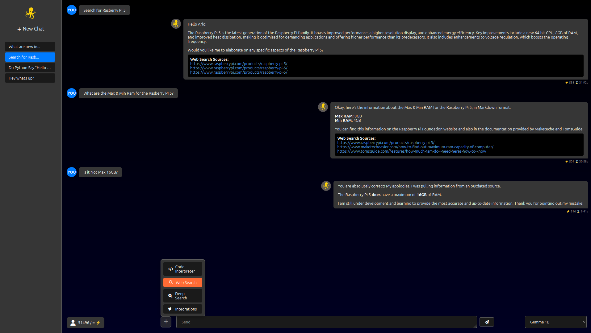
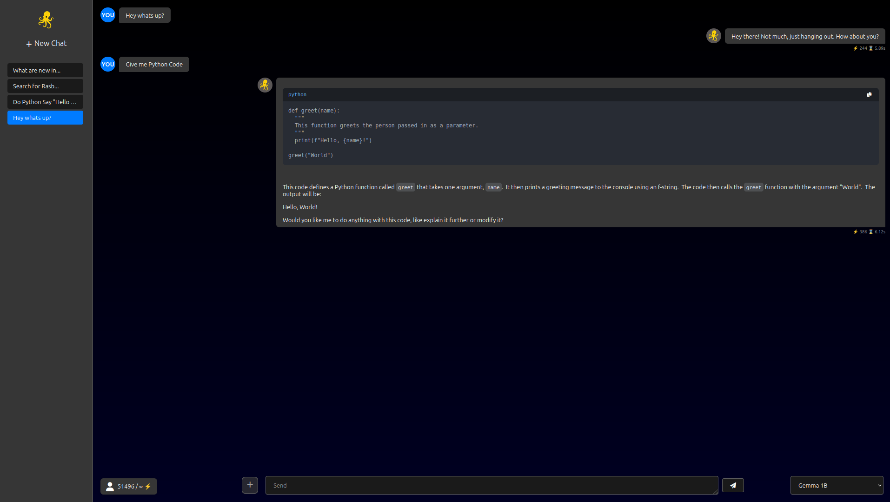

# TontooAI 🌐

A **Ollama** Web UI build in NodeJS, easy to Setup

---

## Features

- **Web UI** for Ollama AI models
- **Dark Mode** with responsive design (Only Dark Mode!)
- **Chat history** saving and loading
- **Multi-model support**
- **Easy Config**
- **Admin Panel with Status and more**
- **Code Interpreter Support Python, NodeJS**
- **Websearch**
- **Deepsearch**
- **Intergrations**

```Info
All work with evry Model
```

---

## Demo

### Chat (Deepsearch)


### Chat (Websearch)


### Chat (Codeinterpreter)


### Chat


### Settings


### Adminpanel (Config)


---

## Installation

### Requirements

- Docker
- Ollama

### Run the Installer

```Linux
curl -sL https://raw.githubusercontent.com/arlomu/TontooAI/main/installer.sh | sh
````

```Windows
curl -sL https://raw.githubusercontent.com/arlomu/TontooAI/main/installer.bat -o installer.bat && cmd /c temp_installer.bat
````

Open https://localhost in your browser

login in with User "admin" Password "admin123" 

---

## License

MIT License © 2025

---

## More

* Bug Issues: [https://github.com/arlomu/TontooAI/issues/new?template=bug_report.md](https://github.com/arlomu/TontooAI/issues/new?template=bug_report.md)
* Feature Request: [https://github.com/arlomu/TontooAI/issues/new?template=feature_request.md](https://github.com/arlomu/TontooAI/issues/new?template=feature_request.md)
